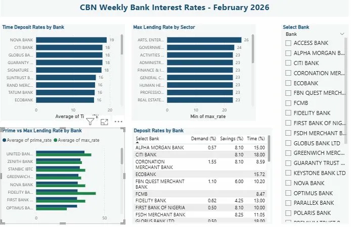

# CBN Weekly Bank Interest Rates — Data Pipeline

A production-style ETL pipeline that extracts, transforms, and loads 
weekly interest rate data published by the Central Bank of Nigeria (CBN).



## Pipeline Overview
**PDF Report → Python ETL → PostgreSQL → FastAPI → Power BI Dashboard**

## What It Does
- Extracts deposit and lending rates for 32 Nigerian banks from CBN weekly PDF reports
- Transforms and structures data into 2 clean PostgreSQL tables
- 736 rows loaded per weekly report (32 banks × 22 sectors)
- 4 REST API endpoints built with FastAPI
- Interactive Power BI dashboard with cross-filtering by bank

## Project Structure
```
bank-rate-etl/
├── scripts/
│   ├── extract.py     # parses PDF to raw CSV
│   ├── transform.py   # cleans and structures data
│   ├── load.py        # loads into PostgreSQL
│   └── api.py         # FastAPI REST endpoints
├── sql/
│   └── schema.sql     # PostgreSQL table definitions
├── data/
├── dashboard.png      # Power BI dashboard screenshot
└── README.md
```

## Setup
1. Install dependencies: `pip install -r requirements.txt`
2. Create PostgreSQL database: `CREATE DATABASE cbn_rates;`
3. Update DB credentials in `load.py` and `api.py`
4. Run pipeline:
```
python scripts/transform.py
python scripts/load.py
```
5. Start API: `uvicorn scripts.api:app --reload`
6. Open `dashboard.pbix` in Power BI Desktop

## API Endpoints
| Method | Endpoint | Description |
|--------|----------|-------------|
| GET | `/rates/deposits` | All banks deposit rates |
| GET | `/rates/deposits/{bank_name}` | Single bank deposit rates |
| GET | `/rates/lending` | All banks lending rates |
| GET | `/rates/lending/{bank_name}` | Single bank lending rates by sector |

## Tech Stack
- **Python** — Pandas, SQLAlchemy, psycopg2
- **PostgreSQL** — data warehouse
- **FastAPI + Uvicorn** — REST API
- **Power BI Desktop** — dashboard and visualization

## Data Source
Central Bank of Nigeria (CBN) — Weekly Interest Rate Report